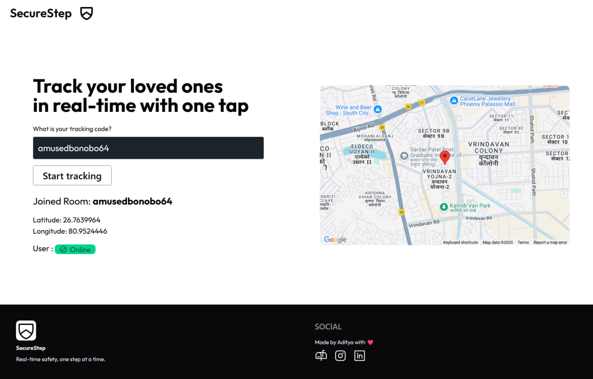

## 🌐 Frontend – SecureSteps Dashboard

The **SecureSteps Companion Website** is a React-based dashboard designed for guardians to **track their loved ones in real time during emergencies**.  

- Displays the **live location** of the user during an active alert.  
- Provides a secure, private “room” for each guardian-user connection.  
- Optimized for quick loading and clear, easy-to-read map data.  

This dashboard works seamlessly with the SecureSteps mobile app to ensure help can be sent **fast and accurately** in times of need.

